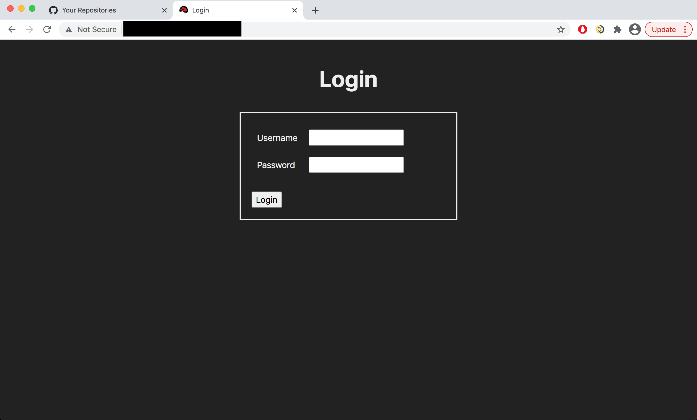
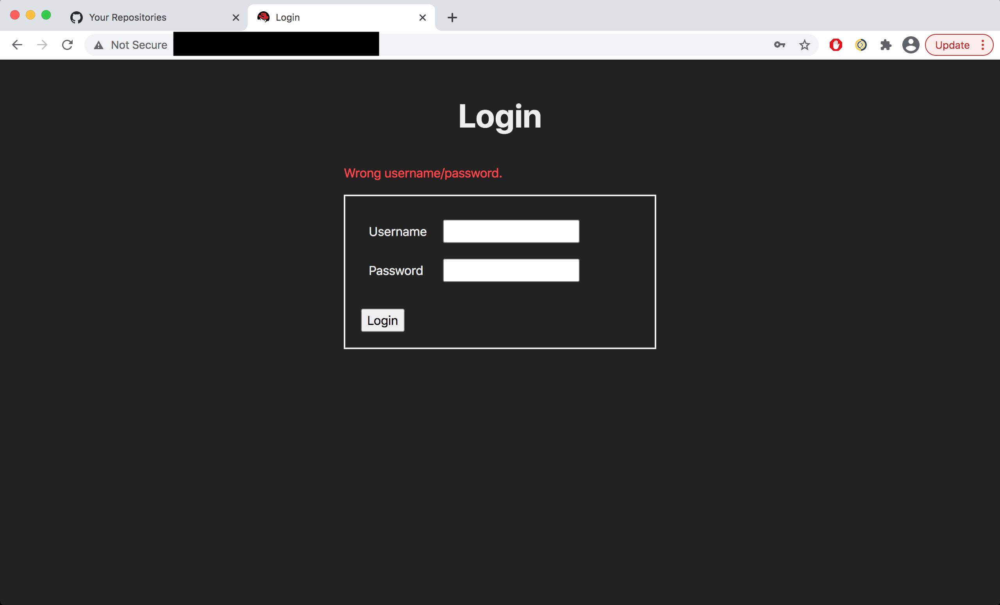
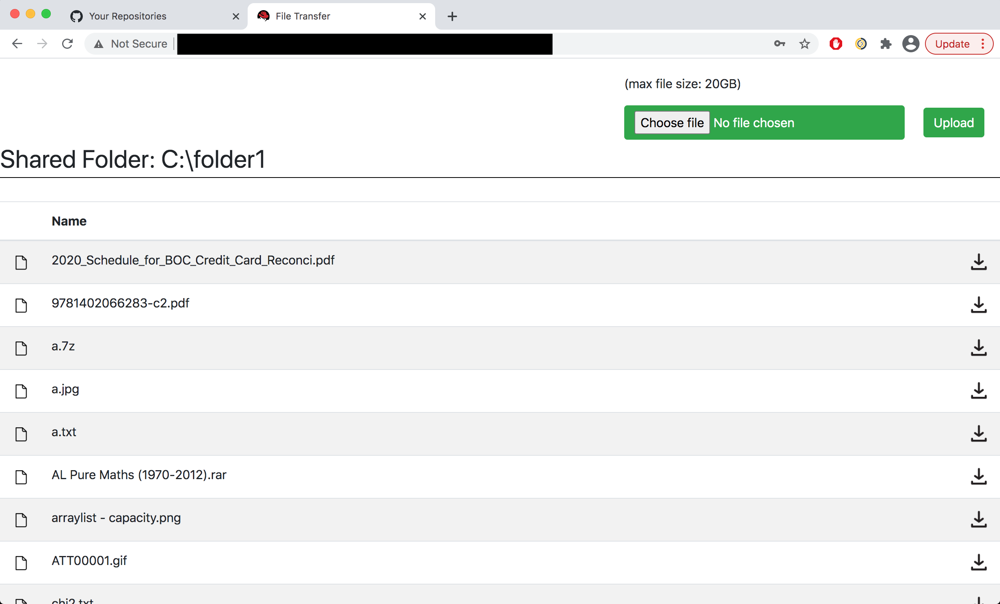
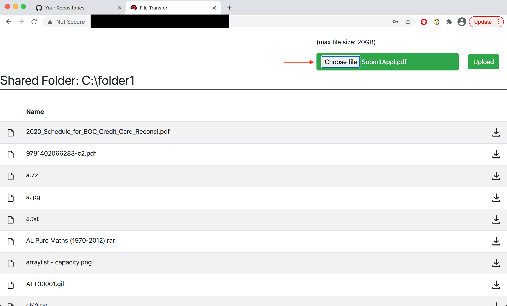
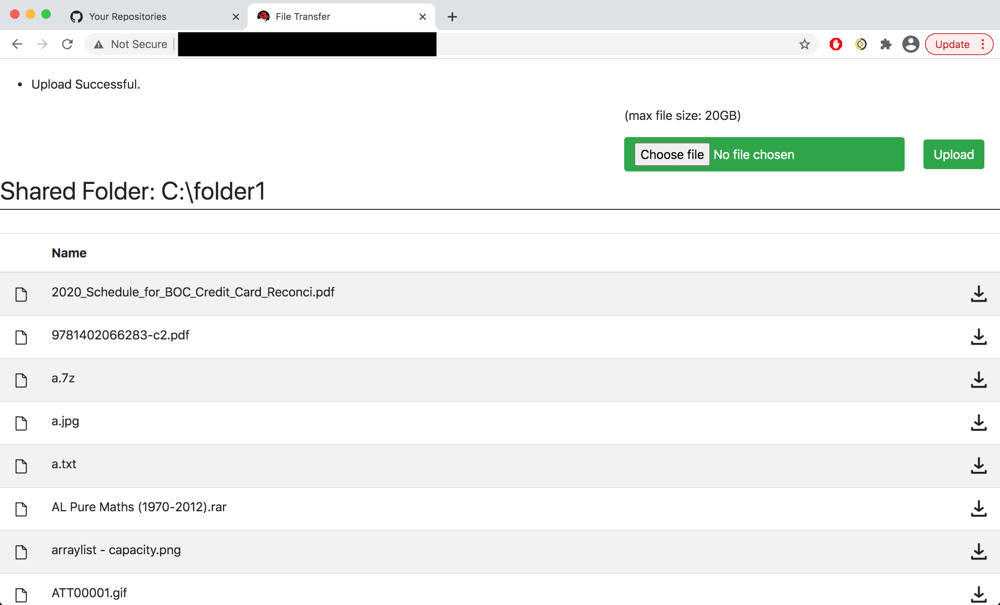
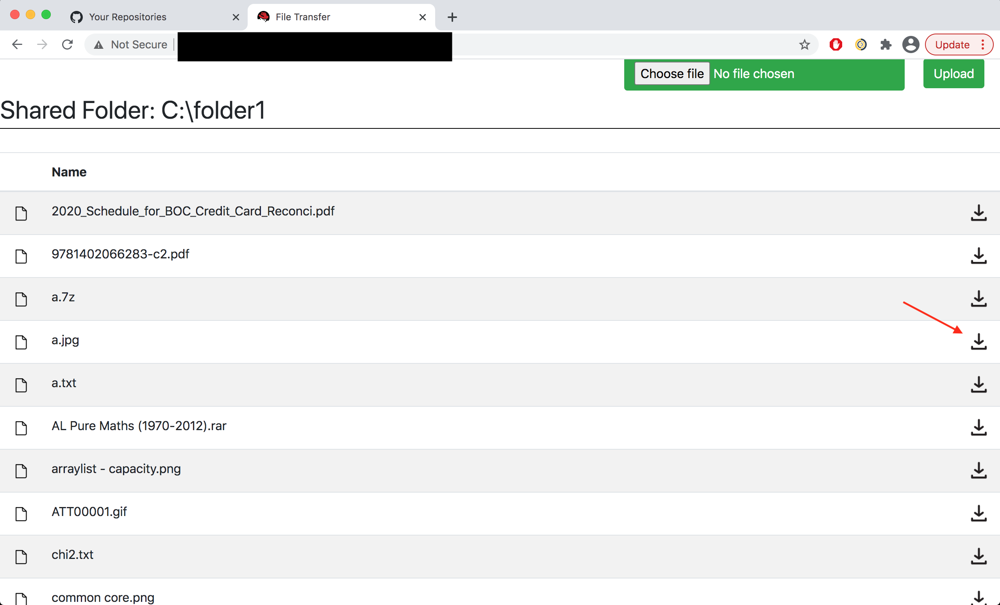
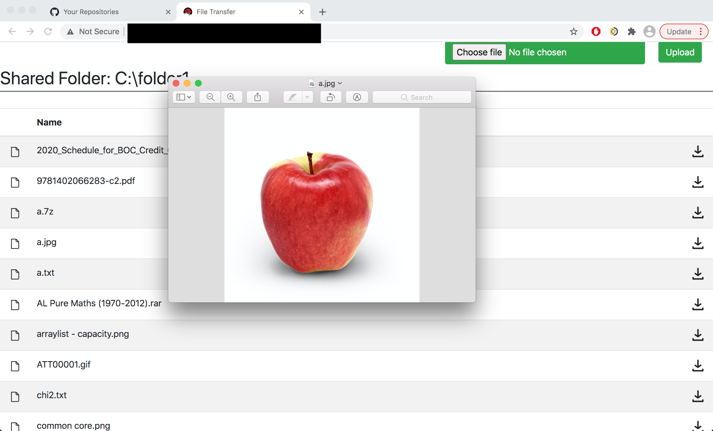
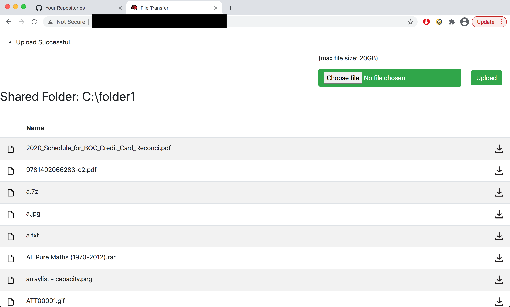

# Java EE File Transfer Web Application

This application allows us to **SECURELY** upload/download any file (e.g. zip/docx/pdf/...) from server to client and vice versa. 

## Environment

- Java EE 6 
- MySQL 5.1.73
- JBoss EAP 7.0
- Apache Ant 1.10.6
- Server OS: Windows XP Pro SP3 x86

## Required libraries

- commons-io-2.5.jar
- commons-lang3-3.9.jar
- javaee-api-6.0.jar
- log4j-api-2.12.1.jar
- log4j-core-2.12.1.jar
- mysql-connector-java-5.1.48.jar

## Installation Steps

1. configure `${PROJECT_DIR}/src/config/file_transfer.properties`. Make sure `ENV.SHARED_FOLDER_PATH` folder is created before using this application.
2. in `${PROJECT_DIR}/WebContent/WEB-INF/web.xml`, set `param-value` of `PROPERTIES_FILEPATH` as `${PROJECT_DIR}/src/config/file_transfer.properties`.
3. in mysql, run `${PROJECT_DIR}/db/create_tables.sql`.
4. in mysql, run `${PROJECT_DIR}/db/sp/FT_FindUserByName.sql`.
5. in mysql, execute
```sql
INSERT INTO FT_USERS VALUES ('<username>', '<sha512-hashed-password>');
```
You will use this account to login and start secure file transfer.

6. import this project in eclipse
7. compile the project using eclipse
8. in `${PROJECT_DIR}`, run 
```sh
ant clean
mkdir dist
ant dist
```
The file transfer program `${PROJECT_DIR}/dist/file_transfer-${version}.ear` should be generated.

9. deploy *file_transfer-1.0.ear* to JBoss

## File Transfer Application URL

http://localhost:8080/file_transfer

## Screenshots

Login



Login Fail



Application



Upload File





Download File





Sort



## License

This application is under GPL v3.0 license. Feel free to modify and add more features to the application. If you use this application for production, please credit my work. Thanks.
